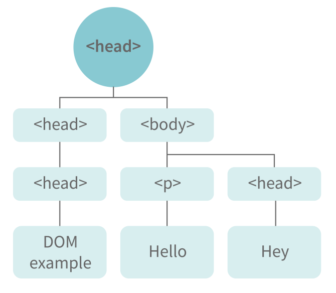
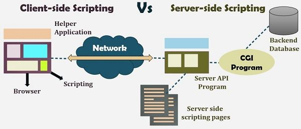

# JavaScript

# Closures:
Closures ka matlab yeh hota hai ki ek function apne outer scope ke variables aur functions ko yaad rakh sakta hai, chahe woh function execute hone ke baad bhi use kare. Matlab, function apne surrounding environment ka reference hold karke rakhta hai.

Agar hum example dekhein:

```js
var Person = function(pName){
  var name = pName;
  this.getName = function(){
      return name;
  }
}

var person = new Person("Neelesh");
console.log(person.getName()); // Output: Neelesh
```

Yahan `name` variable `Person` function ke andar declare hua hai, jo normally function ke bahar access nahi ho sakta. Lekin `getName()` function us variable ko access kar sakta hai, kyunki closure ke wajah se `name` ka reference bana rehta hai.

### One More Example:

```js
function randomFunc(){
  var obj1 = {name:"Vivian", age:45};
  return function(){
      console.log(obj1.name + " is awesome");
  }
}

var initialiseClosure = randomFunc(); // Yeh ek function return karega
initialiseClosure(); // Output: Vivian is awesome
```

#### Is code ko samajhte hain:
1. Jab `randomFunc()` call hota hai, yeh ek function return karta hai jo `obj1` ka use kar raha hai.
   ```js
   var initialiseClosure = randomFunc();
   ```
2. Ab jab hum `initialiseClosure()` ko call karte hain:
   ```js
   initialiseClosure(); 
   ```

   Toh output aata hai:
   ```
   Vivian is awesome
   ```

### Yeh kaise possible hua?
- Jab `randomFunc()` execute hota hai, toh normally uska `obj1` variable memory se hat jana chahiye.
- **Lekin**, jo function return hua hai (`return function() { console.log(obj1.name + " is awesome"); }`), woh `obj1` ko use kar raha hai.
- JavaScript ka closure mechanism ensure karta hai ki `obj1` ka reference memory me bana rahe, taki return hua function usko access kar sake.

### Conclusion:
Closure ki wajah se ek function apne outer scope ke variables ko yaad rakh sakta hai, chahe parent function execute ho chuka ho. Yeh concept tab useful hota hai jab hume **data encapsulation**, **callback functions**, aur **event handling** jaise scenarios me variables ko preserve karna ho.

This ability of a function to store a variable for further reference even after it is executed is called **Closure**.


# Object Prototypes
JavaScript me har object kisi na kisi **prototype** se properties aur methods inherit karta hai. Matlab, objects apne prototype se features lete hain aur unhe use karte hain.

### Kuch Examples:
- **Date objects** → `Date.prototype` se properties inherit karte hain.
- **Math objects** → `Math.prototype` se properties inherit karte hain.
- **Array objects** → `Array.prototype` se properties inherit karte hain.
- **Sabse upar** `Object.prototype` hota hai, jisse har prototype properties aur methods inherit karta hai.

### Prototype Kya Kaam Karta Hai?
Prototype ek object ka **blueprint** hota hai. Yeh allow karta hai ki ek object par woh properties aur methods use ho sakein jo usme directly exist nahi karte.

### Example:
```js
var arr = [];
arr.push(2);
console.log(arr); // Output: [2]
```

#### Yeh Kaise Work Karta Hai?
- Yahan `arr` ek empty array hai.
- Humne `arr.push(2)` use kiya, lekin `push` method humne khud define nahi ki.
- JavaScript engine sabse pehle check karega ki `push` method `arr` object ke andar hai ya nahi.
- Jab `push` method `arr` me nahi mila, toh engine `Array.prototype` me check karega.
- `Array.prototype` me `push` method mil gaya, toh woh execute ho jayega.

### Prototype Chain:
Agar ek property ya method **current object** me nahi milti, toh JavaScript engine **uske prototype** me check karega. Agar wahan bhi nahi mili, toh **us prototype ke prototype** me check karega. Yeh process tab tak chalega jab tak `Object.prototype` tak nahi pahunch jata.

### Conclusion:
Prototype system ki wajah se hum JavaScript objects ko **reusable** bana sakte hain aur **inheritance** implement kar sakte hain. Agar koi method ya property directly object me na ho, toh JavaScript uske prototype me automatically check karti hai.


# Callbacks
JavaScript me **callback ek function hota hai jo tab execute hota hai jab dusra function execute ho chuka ho**. JavaScript me functions **first-class citizens** hote hain, iska matlab:
- Functions ko ek argument ki tarah pass kiya ja sakta hai.
- Functions ko return bhi kiya ja sakta hai.
- Functions ko ek object ki property ke roop me bhi use kiya ja sakta hai.

Jab ek function ko dusre function ke argument ki tarah diya jata hai, usse **callback function** kehte hain.

### Example:
```js
function divideByHalf(sum){
    console.log(Math.floor(sum / 2));
}
function multiplyBy2(sum){
    console.log(sum * 2);
}
function operationOnSum(num1, num2, operation){
    var sum = num1 + num2;
    operation(sum);
}

operationOnSum(3, 3, divideByHalf); // Output: 3
operationOnSum(5, 5, multiplyBy2); // Output: 20
```

#### Is Code Ka Explanation:
- `operationOnSum` function **3 arguments** leta hai → `num1`, `num2`, aur ek **operation (callback function)**
- `num1` aur `num2` ka sum nikalta hai.
- Fir callback function (`operation`) ko call karta hai jo `sum` par operation apply karta hai.
- `divideByHalf` aur `multiplyBy2` dono **callback functions** hain.

#### Callback Function Kaise Kaam Karta Hai?
1. Jab `operationOnSum(3, 3, divideByHalf);` call hota hai:
   - `sum = 3 + 3 = 6`
   - `divideByHalf(6)` call hota hai → Output: `3`

2. Jab `operationOnSum(5, 5, multiplyBy2);` call hota hai:
   - `sum = 5 + 5 = 10`
   - `multiplyBy2(10)` call hota hai → Output: `20`

### Conclusion:
Callback function ek **important concept** hai jo asynchronous programming me kaafi useful hota hai, jaise ki:
- Event handling
- API calls
- Timers (`setTimeout`, `setInterval`)

Yeh mechanism ensure karta hai ki ek function dusre function ke execute hone ke baad hi chale, jo JavaScript me **non-blocking execution** ke liye kaafi important hai!


# Errors in JavaScript
JavaScript me errors **do tarike ke hote hain:**

### 1. Syntax Error
- Jab hum code likhte waqt **galat syntax** use karte hain ya koi **spelling mistake** hoti hai, tab **syntax error** aata hai.
- Is wajah se program **execute nahi hota** ya beech me **ruk jata hai**.
- JavaScript ek **error message** bhi deta hai jo batata hai ki problem kaha hai.

#### Example:
```js
console.log('Hello World) // Missing closing quote
```
**Error:** `Uncaught SyntaxError: missing ) after argument list`

### 2. Logical Error
- Jab **code ka syntax sahi hota hai** lekin **logic galat hota hai**, toh **logical error** aata hai.
- Is type ke errors me **koi error message nahi milta**, lekin output **galat aata hai**.
- Yeh **debug karna mushkil hota hai** kyunki program bina error ke chal jata hai, par sahi result nahi deta.

#### Example:
```js
function add(a, b) {
    return a - b; // Galti se '-' use kar diya '+' ki jagah
}
console.log(add(5, 3)); // Output: 2 (Jo ki galat hai, expected 8 tha)
```

### Conclusion
- **Syntax Errors** ko JavaScript **detect aur report** karta hai, isliye inhe fix karna **asan** hota hai.
- **Logical Errors** me koi warning nahi milti, isliye debugging **mushkil** hoti hai.
- Logical errors ko fix karne ke liye **console.log()** aur **debugging tools** ka use karna zaroori hota hai.

Agar aapko JavaScript me coding karte waqt error aaye toh error message ko **dhyan se padho** aur debugging tools ka use karo!


# Memoization
Memoization ek **caching technique** hai jisme **function ka return value uske parameters ke basis par cache kiya jata hai**. Agar function **same parameters ke saath dobara call hota hai**, toh **computed result dobara calculate nahi hota, balki cache se return hota hai**.

Yeh concept **expensive function calls** ke liye kaafi useful hota hai kyunki yeh **execution time ko optimize** karta hai.

### Simple Function Example:
```js
function addTo256(num){
    return num + 256;
}
console.log(addTo256(20)); // Output: 276
console.log(addTo256(40)); // Output: 296
console.log(addTo256(20)); // Output: 276 (dobara calculate ho raha hai)
```

#### Problem:
- Jab hum **same parameter** ke saath function dobara call karte hain, toh **result dubara compute hota hai**.
- Chhoti functions ke liye koi dikkat nahi, lekin agar **function heavy computation kare**, toh ye **time waste karega**.

##### Memoized Function Example:
```js
function memoizedAddTo256(){
    var cache = {}; // Cache store karne ke liye object
    return function(num){
        if(num in cache){
            console.log("cached value");
            return cache[num];
        } else {
            cache[num] = num + 256;
            return cache[num];
        }
    }
}

var memoizedFunc = memoizedAddTo256();
console.log(memoizedFunc(20)); // Normal return: 276
console.log(memoizedFunc(20)); // Cached return: 276
```

#### Solution:
- **Cache object** store karta hai **pehle se computed results**.
- Jab **same input dobara aata hai**, toh **cache se result return hota hai** instead of re-calculating.

### Memoization Ke Advantages Aur Disadvantages:
#### Advantages:
- **Execution fast hoti hai**, kyunki **dobara calculation avoid hota hai**.
- **Expensive function calls ka time save hota hai**.
- **Performance optimize hoti hai**, especially jab **large computations ya recursive functions ho**.

#### Disadvantages:
- **Memory zyada consume hoti hai**, kyunki **computed results ko store karna padta hai**.
- **Har case me useful nahi hota**, agar function ka output frequently change hota hai toh caching ka fayda nahi hoga.

### Conclusion:
Memoization **JavaScript me performance optimization ka ek powerful concept hai** jo **repeated function calls ko fast banata hai**. Lekin iska **sahi use case samajhna zaroori hai**, taki **memory aur speed ke beech balance maintain kiya ja sake**. 


# Recursion
Recursion ek **technique hai jisme ek function khud ko dobara call karta hai** jab tak ek base condition **satisfy** na ho jaye. Yeh tarika **iteration ka ek alternative** hai jo complex problems ko **simplify** karne me madad karta hai.

### Example: Simple Recursive Function
```js
function add(number) {
    if (number <= 0) {
        return 0; // Base condition
    } else {
        return number + add(number - 1); // Recursive call
    }
}
console.log(add(3));
```
#### Execution Flow:
```js
add(3)  =>  3 + add(2)
              2 + add(1)
                  1 + add(0)
                      0
Final Output: 3 + 2 + 1 + 0 = 6
```

Yahan, **function bar-bar khud ko call karta hai jab tak number 0 na ho jaye**. Jab **base condition satisfy hoti hai (number <= 0)**, tab recursion ruk jata hai.

### Example: Recursive Function to Compute Sum of an Array
```js
function computeSum(arr){
    if(arr.length === 1){
        return arr[0]; // Base condition
    } else {
        return arr.pop() + computeSum(arr); // Recursive call
    }
}
console.log(computeSum([7, 8, 9, 99])); // Output: 123
```
#### Execution Flow:
```js
computeSum([7, 8, 9, 99])  =>  99 + computeSum([7, 8, 9])
                                    9 + computeSum([7, 8])
                                        8 + computeSum([7])
                                            7 (Base case reached)
Final Output: 99 + 9 + 8 + 7 = 123
```

### Recursion Ke Advantages Aur Disadvantages:
#### Advantages:
- **Complex problems ko chhoti problems me todta hai**, jisse code **zyada readable** hota hai.
- **Loop ki zaroorat nahi padti**, jo code ko **concise** banata hai.
- **Tree structure ya factorial, Fibonacci jaise problems** ke liye recursion kaafi useful hota hai.

#### Disadvantages:
- **Zyada recursive calls se stack overflow ho sakta hai**, jo program **crash** kar sakta hai.
- **Memory consumption badh sakti hai**, kyunki **har recursive call ke liye stack me ek naya frame banta hai**.
- **Agar base condition galat ho ya missing ho**, toh **infinite recursion ho sakta hai**.

### Conclusion:
Recursion **JavaScript me ek powerful concept hai** jo problems ko **simplify aur optimize** karne me madad karta hai. Lekin iska **sahi implementation** zaroori hai taki **performance aur memory issues na aaye**.


# Constructor Function
JavaScript me **constructor functions ka use objects banane ke liye hota hai**. Jab hume **multiple objects create karne hote hain jisme same properties aur methods hote hain**, tab hum constructor function ka use karte hain.

### Kab Use Karte Hain?
- Jab **multiple objects create karne ho jisme same type ke properties aur methods ho**.
- Jab **manual tarike se har baar naye object create karna inefficient ho**.

#### Note:
- **Constructor function ka naam Pascal Notation me likhna chahiye** (Har word capital letter se start hona chahiye).

### Example: Constructor Function
```js
function Person(name, age, gender) {
    this.name = name;
    this.age = age;
    this.gender = gender;
}

var person1 = new Person("Vivek", 76, "male");
console.log(person1);

var person2 = new Person("Courtney", 34, "female");
console.log(person2);
```

### Output:
```js
Person { name: "Vivek", age: 76, gender: "male" }
Person { name: "Courtney", age: 34, gender: "female" }
```

### Kaise Kaam Karta Hai?
1. **Person ek constructor function hai**, jo name, age, aur gender properties ko set karta hai.
2. Jab **new keyword ke sath Person function ko call karte hain**, ek naya object create hota hai.
3. Har baar jab naya object create hota hai, usme **same structure aur properties hoti hain**.

#### Ek Aur Object Create Karna
```js
var person3 = new Person("Lilly", 17, "female");
console.log(person3);
```
**Output:**
```js
Person { name: "Lilly", age: 17, gender: "female" }
```

### Constructor Functions Ke Advantages aur Disadvantages:
#### Advantages:
- **Code reuse hota hai**, har baar manually object create karne ki zaroorat nahi.
- **Multiple objects easily create kar sakte hain** jo similar properties aur methods share karte hain.
- **Object-oriented programming (OOP) ka ek important concept hai**, jo code ko **organized aur scalable** banata hai.

#### Disadvantages:
- Agar `new` keyword bhool gaye toh function normal tarike se execute hoga aur global scope me variables create ho sakte hain.
- **Har object ke liye naye methods create hote hain**, jo memory inefficient ho sakta hai (Iska solution prototype use karna hai).

### Conclusion:
Constructor functions **JavaScript me objects create karne ka ek powerful tarika hai** jo code ko **modular aur reusable** banata hai. **Agar aapko ek jaise multiple objects chahiye, toh constructor function best choice hai!**


# DOM (Document Object Model)
DOM ka full form **Document Object Model** hai. Yeh ek **programming interface** hai jo HTML aur XML documents ke liye use hota hai.

Jab browser ek HTML document ko render karta hai, tab yeh ek **object-based structure** create karta hai jise **DOM** kehte hain. Iska use karke hum HTML document ke elements ko dynamically manipulate kar sakte hain.

### DOM Kaise Kaam Karta Hai?
1. Jab ek web page load hota hai, **browser HTML code ko parse karta hai**.
2. Fir ek **DOM tree** generate hoti hai jo **HTML elements ka ek structured representation** hoti hai.
3. JavaScript ka use karke hum **DOM ke elements ko modify ya manipulate** kar sakte hain.

### Example: Conversion of HTML code to DOM

#### HTML Code:
```html
<!DOCTYPE html>
<html>
<head>
    <title>My Page</title>
</head>
<body>
    <h1>Welcome to DOM</h1>
    <p>This is a paragraph.</p>
</body>
</html>
```

#### DOM Structure (Graphical Representation):



### DOM Manipulation Example:
Hum JavaScript ka use karke DOM elements ko dynamically modify kar sakte hain.

```js
document.querySelector("h1").innerText = "DOM Manipulated!";
```

**Output:** Page ka `<h1>` tag update ho jayega aur "DOM Manipulated!" show karega.

### Advantages of DOM:
- **Dynamic changes:** JavaScript ke through HTML elements ko **modify kar sakte hain**.
- **Event Handling:** Click, hover, input jaise **events handle karne ke liye** DOM ka use hota hai.
- **Real-time Updates:** DOM ki madad se **live content update** ho sakta hai bina page reload kiye.

### Conclusion:
DOM ek **powerful concept hai jo web development me dynamic changes aur interaction ke liye use hota hai**. JavaScript ki madad se hum **DOM elements ko modify, delete, ya update** kar sakte hain jo **interactive web pages** banane me madad karta hai. 

# charAt() Method in JavaScript
JavaScript me **charAt()** ek built-in method hai jo **string ke kisi bhi index par maujood character ko return karta hai**. Iska index **0 se shuru hota hai** aur **n-1 tak hota hai**, jisme `n` string ka length hai.

### Syntax:
```js
string.charAt(index)
```

- **index**: Yeh ek number hai jo batata hai ki kaunsa character return karna hai.

- **Return Value**: Agar index valid hai toh corresponding character return hota hai, nahi toh empty string `""` return hoti hai.

### Example:
```js
let str = "JavaScript";
console.log(str.charAt(0)); // Output: 'J'
console.log(str.charAt(4)); // Output: 'S'
console.log(str.charAt(10)); // Output: '' (empty string)
```

### Important Points:
- **Index 0-based hota hai** (matlab pehla character index `0` par hota hai).
- **Agar index string ki length se zyada ho, toh empty string return hoti hai**.
- **charAt() method case-sensitive hoti hai**.

### Alternative:
Agar hume direct indexing se character retrieve karna ho, toh hum **bracket notation (`[]`)** ka bhi use kar sakte hain:
```js
console.log(str[0]); // Output: 'J'
console.log(str[4]); // Output: 'S'
```
Lekin, agar invalid index diya jaye toh `undefined` return hoga.

### Conclusion:
JavaScript ka `charAt()` method ek simple tarika hai kisi **specific position** par maujood **character ko retrieve karne ke liye**. Agar index range me nahi hai toh **empty string return hoti hai**.


# BOM (Browser Object Model) in JavaScript
BOM ka full form **Browser Object Model** hota hai. Yeh ek JavaScript ka feature hai jo **browser ke sath interact karne** ki facility deta hai.

BOM ka **sabse main object `window` hota hai**, jisme browser ke different functionalities ko access karne ke liye multiple properties aur methods hote hain.

### BOM ke Important Objects

#### 1. `window` Object
- Browser ka **sabse root object** hota hai.
- Saare browser-related objects aur methods iske andar aate hain.

**Example:**
```js
console.log(window.innerHeight); // Window ka height print karega
console.log(window.innerWidth);  // Window ka width print karega
```

#### 2. `document` Object
- Iska use **HTML document ko access aur modify karne ke liye** hota hai.

**Example:**
```js
document.title = "New Page Title"; // Webpage ka title change karega
```

#### 3. `history` Object
- Yeh **browser history** ko control karne ke liye use hota hai.

**Example:**
```js
history.back(); // Ek page piche jayega
history.forward(); // Ek page aage jayega
```

#### 4. `navigator` Object
- Iska use **browser aur user ke system ke baare me information** retrieve karne ke liye hota hai.

**Example:**
```js
console.log(navigator.userAgent); // Browser ka info dikhayega
console.log(navigator.language); // User ka preferred language dikhayega
```

#### 5. `location` Object
- Iska use **current URL ke baare me information lene aur usko change karne ke liye** hota hai.

**Example:**
```js
console.log(location.href); // Current page ka URL dikhayega
location.href = "https://www.google.com"; // Page ko Google par redirect karega
```

### Conclusion:
BOM ek **powerful feature** hai jo **browser ke different aspects ko control** karne me madad karta hai. Iska main object `window` hota hai jisme **document, history, navigator, location, screen** jaise objects hote hain jo alag-alag browser functionalities ko control karne me madad karte hain.


# Client-Side vs Server-Side JavaScript

### Client-Side JavaScript
- Client-side JavaScript ka use **browser ke andar** hota hai.
- Yeh **HTML pages ke andar** likha jata hai aur browser isse **directly execute** karta hai.
- Isme **UI manipulation, form validation, animations, API requests** jaise kaam kiye ja sakte hain.

#### Example:
```js
// Button click par alert show karne wala client-side JavaScript code
function showAlert() {
    alert("Hello, this is Client-Side JavaScript!");
}
```

#### Famous Client-Side Frameworks/Libraries:
- React.js
- Angular
- Vue.js

### Server-Side JavaScript
- Server-side JavaScript ka use **backend logic aur database handling** ke liye hota hai.
- Yeh **directly browser me execute nahi hota**, balki **server par run hota hai** aur client ko response bhejta hai.
- Server-side JavaScript **Node.js** ka use karke likha jata hai.

#### Example:
```js
// Simple Node.js server jo ek message return karega
const http = require('http');
http.createServer((req, res) => {
    res.writeHead(200, { 'Content-Type': 'text/plain' });
    res.end('Hello from Server-Side JavaScript!');
}).listen(3000);
```

#### Famous Server-Side Frameworks:
- Node.js
- Express.js
- Nest.js



### Client-Side vs Server-Side JavaScript Comparison
| Feature | Client-Side JavaScript | Server-Side JavaScript |
|---------|----------------------|----------------------|
| Execution | Browser ke andar | Server par |
| Speed | Fast (local execution) | Relatively slow (server processing) |
| Security | Less secure | More secure |
| Use Case | UI Manipulation, Form Validation | Database Handling, API Development |

### Conclusion
Client-side JavaScript **browser me execute hota hai** aur mainly **UI aur interactivity** handle karta hai, jabki Server-side JavaScript **server me execute hota hai** aur **data processing, authentication, aur database operations** handle karta hai.

Dono milke **full-stack development** ka part bante hain.