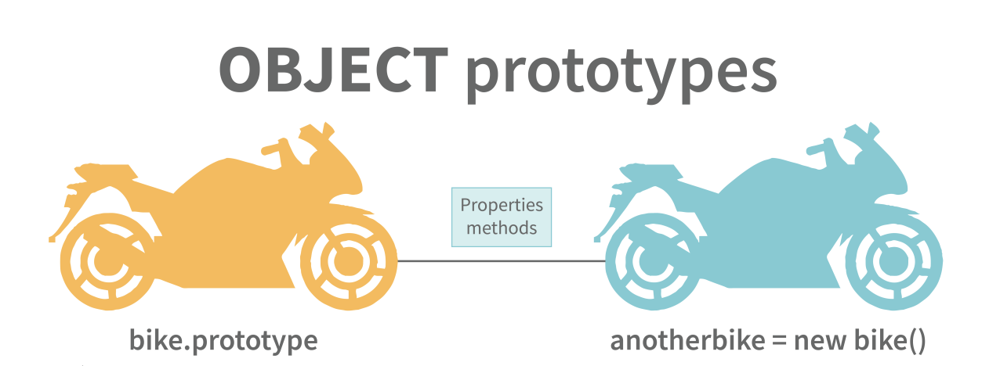

# JavaScript

# Contents
- [Different Data Types in JavaScript](#different-data-types-in-javascript)
- [Hoisting in JavaScript](#hoisting-in-javascript)
- [Debugger in JavaScript](#debugger-in-javascript)
- [Difference between "==" and "===" Operators](#difference-operators)
- [Difference between var aur let keyword in JavaScript](#difference-between-var-and-let-keyword-in-javascript)
- [Implicit Type Coercion in JavaScript](#implicit-type-coercion-in-javascript)
- [JavaScript Dynamically Typed Language](#javascript-dynamically-typed-language)
- [NaN Property in JavaScript](#nan-property-in-javascript)
- [Passed by Value vs Passed by Reference in JavaScript](#passed-by-value-vs-passed-by-reference-in-javascript)
- [Immediately Invoked Function (IIFE) in JavaScript](#immediately-invoked-function-iife-in-javascript)
- [JavaScript Strict Mode](#javascript-strict-mode)
- [Higher Order Functions in JavaScript](#higher-order-functions-in-javascript)
- [`this` Keyword in JavaScript](#this-keyword-in-javascript)
- [Self Invoking Functions in JavaScript](#self-invoking-functions-in-javascript)
- [call(), apply(), and bind() Methods in JavaScript](#call-apply-and-bind-methods-in-javascript)
- [Difference between exec() and test() Methods in JavaScript](#difference-between-exec-and-test-methods-in-javascript)
- [Currying in JavaScript](#currying-in-javascript)
- [Advantages of using External JavaScript](#advantages-of-using-external-javascript)
- [Scope and Scope Chain in JavaScript](#scope-and-scope-chain-in-javascript)
- [Closures](#closures)
- [Object Prototypes](#object-prototypes)
- [Callbacks](#callbacks)
- [Errors in JavaScript](#errors-in-javascript)
- [Memoization](#memoization)
- [Recursion](#recursion)
- [Constructor Function](#constructor-function)
- [DOM (Document Object Model)](#dom-document-object-model)
- [charAt() Method in JavaScript](#charat-method-in-javascript)
- [BOM (Browser Object Model)](#bom-browser-object-model)
- [Client-Side vs Server-Side](#client-side-vs-server-side)

# Different Data Types in JavaScript
JavaScript me hum alag-alag tarah ke data types use kar sakte hain. Data type jaan'ne ke liye hum `typeof` operator ka use kar sakte hain.

### 1. Primitive Types
Primitive data types simple hote hain aur ek hi value store kar sakte hain.

#### **String**
String ek sequence of characters hota hai jo quotes me likha jata hai. Yeh single ya double quotes dono me ho sakta hai.
```javascript
var str = "Vivek Singh Bisht"; // Double quotes
var str2 = 'John Doe'; // Single quotes
```

#### **Number**
Number ek numeric value hota hai jo decimals ke saath ya bina decimals ke ho sakta hai.
```javascript
var x = 3; // Without decimal
var y = 3.6; // With decimal
```

#### **BigInt**
Yeh tab use hota hai jab number data type ka limit exceed ho jaye. Iske liye ek integer ke aage `n` lagaya jata hai.
```javascript
var bigInteger = 234567890123456789012345678901234567890n;
```

#### **Boolean**
Boolean sirf `true` ya `false` value hold karta hai, jo zyadatar conditions check karne ke kaam aata hai.
```javascript
var a = 2;
var b = 3;
var c = 2;
console.log(a == b); // false
console.log(a == c); // true
```

#### **Undefined**
Jab ek variable declare kiya jaye lekin usko koi value assign na ho, toh uski value `undefined` hoti hai.
```javascript
var x; // undefined
var y = undefined; // explicitly undefined set kiya gaya hai
```

#### **Null**
`null` ka matlab hai ki variable ki koi value nahi hai.
```javascript
var z = null;
```

#### **Symbol**
Symbol ek unique aur anonymous value store karne ke liye use hota hai, jo ES6 me introduce kiya gaya tha.
```javascript
var symbol1 = Symbol('symbol');
```

#### typeof Primitive Types
```javascript
typeof "John Doe" // "string"
typeof 3.14 // "number"
typeof true // "boolean"
typeof 234567890123456789012345678901234567890n // "bigint"
typeof undefined // "undefined"
typeof null // "object" // (JavaScript ka ek bug)
typeof Symbol('symbol') // "symbol"
```

### 2. Non-Primitive Types
Non-primitive types ka use complex aur multiple values store karne ke liye hota hai.

#### **Object**
Object key-value pairs me data store karne ke liye use hota hai.
```javascript
var obj1 = {
    x: 43,
    y: "Hello world!",
    z: function(){
        return this.x;
    }
};
```

#### Array
Array ek ordered list hota hai jo multiple values store kar sakta hai.
```javascript
var array1 = [5, "Hello", true, 4.1];
```

#### Note:
Agar koi bhi data type primitive nahi hai, toh wo **Object** type ka hi hoga JavaScript me.


# Hoisting in JavaScript
Hoisting JavaScript ka default behavior hai jisme saare variable aur function declarations ko scope ke top par move kar diya jata hai.

Iska matlab yeh hai ki chahe variables aur functions kahin bhi declare kiye gaye ho, unhe execution se pehle top par le jaaya jata hai. Yeh scope local bhi ho sakta hai aur global bhi.

### Example 1:
```javascript
hoistedVariable = 3;
console.log(hoistedVariable); // Output: 3 (Even when declared later)
var hoistedVariable;
```
Yahan pe hoistedVariable ko declare karne se pehle use kiya gaya hai, lekin phir bhi koi error nahi aaya. Kyunki JavaScript automatically isko upar le gaya hai.

### Example 2:
```javascript
hoistedFunction(); // Output: "Hello world!"

function hoistedFunction(){
    console.log("Hello world!");
}
```
Function declarations bhi hoist ho jaati hain. Is wajah se hoistedFunction() function call pehle likhne ke bawajood bhi error nahi aata.

### Example 3:
Hoisting local scope me bhi hoti hai:
```javascript
function doSomething(){
    x = 33;
    console.log(x);
    var x;
}
doSomething(); // Output: 33
```
Is example me, variable `x` ko declare karne se pehle use kiya gaya hai, lekin JavaScript usko pehle top par le jaati hai.

### Important Points:
1. **Variable Initialization hoist nahi hoti, sirf declaration hoti hai.**
   ```javascript
   console.log(y); // Output: undefined
   var y = 10;
   ```
   Yahan variable `y` ka declaration top par chala gaya, lekin initialization nahi hui, isliye output `undefined` aata hai.

2. **Strict Mode use karne se hoisting avoid ho sakti hai:**
   ```javascript
   "use strict";
   x = 23; // Error: x is not defined
   var x;
   ```
   "use strict" mode me agar variable declare kiya bina use kiya jaye toh error aayega.

### Conclusion:
Hoisting ki wajah se JavaScript me variables aur functions ka behavior thoda unpredictable ho sakta hai. Isiliye hamesha variables aur functions ko scope ke start me hi declare karna best practice hai!


# Debugger in JavaScript
JavaScript me debugging ke liye browser ka debugger activate karna zaroori hota hai. Built-in debuggers ko on aur off kiya ja sakta hai, jismein user ko errors detect karne ki zaroorat hoti hai.

Jab debugging mode me hota hai, toh code ka execution waha ruk jata hai jaha debugger lagaya gaya hai, taki developer step-by-step code ko analyze kar sake.

### Example:

```javascript
function testDebugger() {
    let x = 10;
    let y = 20;
    debugger; // Yaha code execution ruk jayega
    let sum = x + y;
    console.log(sum);
}

testDebugger();
```

Agar aap browser ke developer tools (F12) me "Sources" tab me jaake debugging enable karte hain, toh "debugger" statement ke waha code execution ruk jayega, jisse aap variables aur execution flow ko inspect kar sakenge.

### Conclusion:
Debugger ka use karke hum code ke errors aur bugs ko easily detect aur fix kar sakte hain. Yeh ek powerful tool hai jo development aur testing me bohot madad karta hai.


<a id="difference-operators"></a>
# Difference between "==" and "===" Operators in JavaScript
Dono comparison operators hain, lekin inka use alag tareeke se hota hai. "==" sirf values ko compare karta hai, jabki "===" values ke saath-saath unke data types ko bhi check karta hai.

### Example:
```javascript
var x = 2;
var y = "2";

console.log(x == y);  // true, kyunki dono ki value same hai
console.log(x === y); // false, kyunki ek number hai aur doosra string
```

### Key Differences:
| Operator  | Description |
|-----------|-------------|
| `==`  | Sirf values compare karta hai, agar types alag hain toh type coercion karke match karta hai. |
| `===` | Values aur data types dono compare karta hai. Agar types match nahi hote toh `false` return hota hai. |

### Conclusion:
Agar aapko sirf value check karni hai toh `==` ka use kar sakte hain, lekin agar aapko value ke saath-saath type bhi match karna hai toh `===` ka use karna best practice hai.


# Difference between var aur let keyword in JavaScript

| Feature | var | let |
|----------|-----|-----|
| Introduction | JavaScript ke shuru se hi `var` use hota aaya hai. | `let` 2015 me JavaScript me add kiya gaya tha. |
| Scope | `var` ka function scope hota hai, yani poore function me accessible hota hai. | `let` ka block scope hota hai, yani sirf us block tak limited hota hai jisme declare kiya gaya hai. |
| Hoisting | `var` variables hoist hote hain, par unka initialization `undefined` hota hai. | `let` bhi hoist hota hai, par use initialization se pehle access nahi kiya ja sakta (temporal dead zone hota hai). |


# Implicit Type Coercion in JavaScript
Implicit type coercion JavaScript ka ek automatic process hai jisme ek data type dusre data type me convert ho jata hai jab ek expression ke operands alag-alag data types ke hote hain.

### String Coercion

Jab `+` operator use hota hai aur ek number ko ek string ke saath add kiya jata hai, toh number automatically string me convert ho jata hai.

#### Example:
```javascript
var x = 3;
var y = "3";
console.log(x + y); // "33"

var a = 24;
var b = "Hello";
console.log(a + b); // "24Hello"
```

#### Important Note:
- Jab `+` operator do numbers par use hota hai, toh result ek number hota hai.
- Jab `+` operator do strings par use hota hai, toh strings concatenate ho jati hain.

```javascript
var firstName = "Vivek";
var lastName = " Bisht";
console.log(firstName + lastName); // "Vivek Bisht"
```

### Boolean Coercion

Boolean coercion tab hoti hai jab logical operators, ternary operators, if statements ya loops use kiye jate hain.

#### Truthy & Falsy Values
- **Falsy Values:** `false, 0, 0n, -0, "", null, undefined, NaN`
- **Truthy Values:** Inke alawa sabhi values truthy hoti hain.

#### Example with `if` statement:
```javascript
var x = 0;
var y = 23;
if(x) { console.log("Ye execute nahi hoga"); }
if(y) { console.log("Ye execute hoga"); } // Output: "Ye execute hoga"
```

#### Logical Operators:
##### OR (`||`) Operator:
- Agar pehli value truthy hai, toh wahi return hoti hai.
- Agar pehli value falsy hai, toh doosri value return hoti hai.

##### AND (`&&`) Operator:
- Agar dono values truthy hain, toh doosri value return hoti hai.
- Agar koi bhi value falsy hai, toh wahi return hoti hai.

#### Example:
```javascript
var x = 220;
var y = "Hello";
var z = undefined;
console.log(x || y); // 220
console.log(x || z); // 220
console.log(x && y); // "Hello"
console.log(y && z); // undefined

if (x && y) {
    console.log("Code chalega"); // Execute hoga
}
if (x || z) {
    console.log("Code chalega"); // Execute hoga
}
```

### Equality Coercion

Equality coercion `==` operator use karne par hoti hai. Yeh dono operands ko same type me convert karta hai aur fir compare karta hai.

#### Example:
```javascript
var a = 12;
var b = "12";
console.log(a == b); // true (coercion ki wajah se types match ho gaye)
```

#### Strict Equality (`===`)
Agar `===` operator use kiya jaye, toh coercion nahi hoti aur direct comparison hota hai.

```javascript
var a = 226;
var b = "226";
console.log(a === b); // false (kyunki types match nahi kar rahe)
```

Implicit type coercion ka use JavaScript me aksar hota hai, par kabhi-kabhi yeh unexpected results de sakta hai, isiliye isko dhyan se handle karna chahiye.


# JavaScript Dynamically Typed Language
JavaScript ek dynamically typed language hai. Iska matlab hai ki variables ka type runtime par check hota hai, na ki compile time par.

### Static vs Dynamic Typing

Statically typed languages jaise ki Java, C++ me variable ka type compile time par fix hota hai, aur us variable ka type badal nahi sakta.

Dynamically typed languages jaise ki JavaScript me variables kisi bhi type ka data store kar sakte hain aur unka type runtime par change ho sakta hai.

### Example:
```javascript
var a = 23; // Yeh ek number hai
console.log(typeof a); // Output: "number"

a = "Hello World!"; // Ab yeh ek string ban gaya
console.log(typeof a); // Output: "string"
```

Iska matlab hai ki JavaScript me variable ko kisi ek specific type ka hone ki zaroorat nahi hoti. Yeh flexibility achi hai, lekin kabhi kabhi unexpected bugs bhi aa sakte hain agar type conversion ka dhyan na diya jaye.

### Conclusion
JavaScript loosely typed ya dynamically typed language hai kyunki variables ka type runtime par decide hota hai aur badal bhi sakta hai.


# NaN Property in JavaScript
JavaScript me `NaN` ka matlab hai "Not-a-Number". Jab kisi calculation ka result ek valid number nahi hota, tab JavaScript `NaN` return karti hai.

### `typeof NaN`
Jab hum `typeof NaN` check karte hain, to JavaScript isse "number" category me rakhti hai:
```js
console.log(typeof NaN); // "number"
```

### `isNaN()` function
`isNaN()` ka use karke hum check kar sakte hain ki koi value `NaN` hai ya nahi.

#### Examples:
```js
console.log(isNaN("Hello")); // true  ("Hello" number nahi hai)
console.log(isNaN(345)); // false (345 ek valid number hai)
console.log(isNaN('1')); // false ('1' ko number me convert kar sakte hain)
console.log(isNaN(true)); // false (true ko 1 me convert kiya ja sakta hai)
console.log(isNaN(false)); // false (false ko 0 me convert kiya ja sakta hai)
console.log(isNaN(undefined)); // true (undefined ko number me convert nahi kar sakte)
```

### Important Note:
- `isNaN()` function kisi bhi value ko pehle number me convert karta hai, fir check karta hai ki wo `NaN` hai ya nahi.
- `NaN` kisi bhi number ke equal nahi hota, even `NaN === NaN` bhi `false` return karta hai.

```js
console.log(NaN === NaN); // false
```

### Conclusion:
Agar kabhi calculation me `NaN` aaye, to iska matlab hai ki koi illegal operation ho raha hai, jaise kisi string ko number me convert karne ki koshish ho rahi hai. `isNaN()` ka use karke hum aise cases detect kar sakte hain.


# Passed by Value vs Passed by Reference in JavaScript
JavaScript me data types do tareeke se pass hote hain:

1. **Passed by Value (Primitive Data Types)**
2. **Passed by Reference (Non-Primitive Data Types)**

### Passed by Value (Primitive Data Types)
Primitive data types jaise ki **Number, String, Boolean, Null, Undefined, Symbol, BigInt** pass hote hain **value** se. Iska matlab ye hai ki jab hum ek variable ki value dusre variable me assign karte hain, to ek **naya copy** banta hai aur dono variables alag-alag memory locations par store hote hain.

#### Example:
```javascript
let a = 10;
let b = a; // 'b' me 'a' ki ek nayi copy chali gayi

b = 20;
console.log(a); // Output: 10 (original value change nahi hoti)
console.log(b); // Output: 20
```
Is example me, `b` me `a` ki value assign hui, par `b` me jo change kiya wo `a` par effect nahi karega kyunki ek naya copy create hua hai.

### Passed by Reference (Non-Primitive Data Types)
Non-primitive data types jaise ki **Objects, Arrays, Functions** pass hote hain **reference** se. Matlab ki jab hum ek object ya array ko dusre variable me assign karte hain, to **sirf uska reference (address) pass hota hai**, na ki uska ek naya copy banta hai.

### Example:
```javascript
let obj1 = { name: "Rahul" };
let obj2 = obj1; // obj2 ko obj1 ka reference milta hai

obj2.name = "Amit";
console.log(obj1.name); // Output: "Amit" (original object change ho gaya)
console.log(obj2.name); // Output: "Amit"
```
Yahan `obj1` aur `obj2` dono same object ko reference kar rahe hain. Is wajah se jab `obj2.name` ko change kiya gaya, to `obj1.name` bhi change ho gaya.

### Conclusion:
| Feature                | Passed by Value (Primitive) | Passed by Reference (Non-Primitive) |
|------------------------|---------------------------|--------------------------------------|
| Data Types            | Number, String, Boolean, Null, Undefined, Symbol, BigInt | Object, Array, Function |
| Copy Behavior         | Naya copy banta hai       | Reference (address) assign hota hai |
| Changes Affect Original? | Nahi                    | Haan (same memory location share hoti hai) |

To agar aapko primitive values me changes ka effect nahi chahiye, to koi problem nahi. Par agar aapko objects ya arrays ke andar changes track karne hain, to dhyan se kaam karna padega!


# Immediately Invoked Function (IIFE) in JavaScript
IIFE ka full form hai "Immediately Invoked Function Expression". Yeh ek aisa function hota hai jo turant execute ho jata hai jaise hi define hota hai.

### Syntax:
```js
(function(){
    // Code yahan likho
})();
```

### Role of Parentheses:

#### 1. First Parenthesis:
```js
(function (){
    // Code yahan likho
})
```
Agar hum bina parenthesis ke likhte hain, toh JavaScript compiler isse ek function declaration samajhta hai aur error throw karta hai kyunki function ka naam nahi diya gaya.

**Wrong Syntax (Error aayega):**
```js
function() {
    // Code yahan likho
}
```

Isliye pehla parenthesis lagate hain jo compiler ko batata hai ki yeh ek function expression hai, function declaration nahi.

#### 2. Second Parenthesis:
```js
(function (){
    // Code yahan likho
})();
```
Ek function tabhi execute hota hai jab usse invoke kiya jaye. Dusra parenthesis function ko turant invoke karne ke liye lagaya jata hai.

**Example:**
```js
(function () {
    console.log("Hello, IIFE!");
})();
```
**Output:**
```
Hello, IIFE!
```

### IIFE ka Use Case:
- **Global Scope Pollution Avoid Karne Ke Liye**
- **Data Encapsulation aur Private Variables Banane Ke Liye**
- **Asynchronous Code me Use Karne Ke Liye**

Yeh ek powerful concept hai jo JavaScript me frequently use hota hai!


# JavaScript Strict Mode
ECMAScript 5 me ek naya feature introduce kiya gaya hai jise JavaScript Strict Mode kehte hain. Yeh ek "strict" operational environment provide karta hai jisme aapka code jyada safe aur error-free hota hai.

By default, JavaScript errors ko ignore ya silently handle kar leta hai, par strict mode me har error clearly throw hoti hai, jo debugging ko easy bana deta hai aur unexpected behaviors avoid karta hai.

### Strict Mode Enable Kaise Kare?
Strict mode ko enable karne ke liye aapko sirf apne JavaScript file ya function ke start me `"use strict";` likhna hota hai:

```javascript
"use strict";

x = 10; // Error: x is not defined
```

Agar strict mode enable hota hai, to bina `var`, `let`, ya `const` ke variable declare karne par error milegi.

### JavaScript Strict Mode Ki Characteristics:

1. **Duplicate arguments allow nahi hote:**
   ```javascript
   "use strict";
   function sum(a, a) { // Error: Duplicate parameter name not allowed
       return a;
   }
   ```

2. **Reserved keywords ko variable ya function name ke roop me use nahi kar sakte:**
   ```javascript
   "use strict";
   var let = 5; // Error: Unexpected strict mode reserved word
   ```

3. **Script ke start me `"use strict";` likhne se strict mode enable hota hai:**
   ```javascript
   "use strict";
   function test() {
       x = 5; // Error: x is not defined
   }
   test();
   ```

4. **Global variables ko automatically declare karna allowed nahi hai:**
   ```javascript
   "use strict";
   x = 15; // Error: x is not defined
   ```

### Strict Mode Ka Use Kyu Karein?
- Errors ko jaldi pakadne me madad karta hai.
- JavaScript ko optimize karta hai, jisse fast execution hoti hai.
- Accidental global variables create hone se bachata hai.
- Safer aur maintainable code likhne me madad karta hai.

Strict mode ka use karna ek achhi practice hai, especially jab aap production-level JavaScript likh rahe ho! 🚀


# Higher Order Functions in JavaScript
JavaScript me wo functions jo doosre functions par operate karte hain, ya to unhe argument ke roop me lete hain ya phir ek function return karte hain, unhe higher-order functions kaha jata hai.

Higher-order functions possible hote hain kyunki JavaScript me functions first-class citizens hote hain, yani functions ko variables me store kar sakte hain, arguments ke roop me pass kar sakte hain aur return bhi kar sakte hain.

## Example:

```javascript
function higherOrder(fn) {
    fn();
}
higherOrder(function() { console.log("Hello world"); });

function higherOrder2() {
    return function() {
        return "Do something";
    };
}
var x = higherOrder2();
x(); // Returns "Do something"
```

# `this` Keyword in JavaScript
JavaScript me `this` keyword function ke andar use hota hai, aur iska value function ko call karne wale object par depend karta hai.

## Example 1:
```javascript
function doSomething() {
    console.log(this);
}
doSomething();
```

Yaha function global context me call ho raha hai, isliye `this` keyword global object ko refer karega. Browser me ye `window` object hota hai.

### Example 2:
```javascript
var obj = {
    name: "vivek",
    getName: function(){
        console.log(this.name);
    }
};
obj.getName();
```

Yaha function `obj` ka ek property hai, to `this` `obj` ko refer karega aur output hoga: `vivek`

### Example 3:
```javascript
var obj = {
    name: "vivek",
    getName: function(){
        console.log(this.name);
    }
};
var getName = obj.getName;
var obj2 = { name: "akshay", getName };
obj2.getName();
```

Yaha `getName()` function ko `obj2` call kar raha hai, isliye `this` `obj2` ko refer karega aur output hoga: `akshay`

### Example 4:
```javascript
var obj1 = {
    address : "Mumbai,India",
    getAddress: function(){
        console.log(this.address);
    }
};
var getAddress = obj1.getAddress;
var obj2 = { name:"akshay" };
obj2.getAddress();
```

Is case me `obj2` me `getAddress` method nahi hai, to ye error throw karega.

### Shortcut Trick:
Agar `this` keyword ka value samajhna hai, to function ke call hone ke waqt `.` ke pehle kis object ka naam likha hai usko dekho. Wahi `this` ka value hota hai.

Agar function bina kisi object ke call ho raha ho, to `this` global object hoga (browser me `window`).


# Self Invoking Functions in JavaScript
Self-invoking function ek aisa function hota hai jo bina kisi call kiye khud hi execute ho jata hai. Iska matlab hai ki jaise hi function define hota hai, waise hi wo run bhi ho jata hai.

### Syntax:
```javascript
(function() {
    console.log("Ye function khud hi execute ho gaya!");
})();
```
#### Explanation:
- Is function ko humne **parentheses ()** ke andar wrap kiya hai taki JavaScript ise ek **function expression** ki tarah samjhe.
- Function ke turant baad `()` likhne se wo **immediately invoke** ho jata hai.
- Ye function **anonymous function** hota hai kyunki iska koi naam nahi hota.

### Self Invoking Function Ka Use:
- **Global Scope Pollution avoid karne ke liye**
- **Code ko encapsulate karne ke liye**
- **Immediately Execution wali functionality chahiye ho to**

### Example:
```javascript
(function(name) {
    console.log("Hello " + name);
})("Vivek");
```
**Output:**
```
Hello Vivek
```
Isme humne function ko turant execute kar diya aur argument bhi pass kar diya.

### Important Points:
1. Function **declaration** self-invoke nahi hoti, sirf **expression** self-invoke ho sakti hai.
2. Self-invoking functions mostly tab use hoti hain jab ek baar hi execute hone wala code likhna ho.

Agar aur doubts hain to batao!


# call(), apply(), and bind() Methods in JavaScript

## 1. call() Method
call() ek predefined method hai jo ek function ko kisi specific object ke sath invoke karne ke liye use hota hai. Yeh method function ke andar jo `this` hota hai usko provided object ke sath bind karta hai.

### Example 1:
```js
function sayHello(){
    return "Hello " + this.name;
}
var obj = {name: "Sandy"};
sayHello.call(obj); // Returns "Hello Sandy"
```

### Example 2:
call() method allow karta hai ek object ko dusre object ke method ko use karne ke liye:
```js
var person = {
    age: 23,
    getAge: function(){
        return this.age;
    }
}
var person2 = {age: 54};
person.getAge.call(person2); // Returns 54
```

### Example 3 (Arguments ke sath):
```js
function saySomething(message){
    return this.name + " is " + message;
}
var person4 = {name: "John"};
saySomething.call(person4, "awesome"); // Returns "John is awesome"
```

## 2. apply() Method
apply() method bhi call() method ki tarah hi kaam karta hai, bas ek difference hai ki call() method arguments ko alag-alag leta hai jabki apply() method unhe ek array ke form me leta hai.

### Example:
```js
function saySomething(message){
    return this.name + " is " + message;
}
var person4 = {name: "John"};
saySomething.apply(person4, ["awesome"]); // Returns "John is awesome"
```

## 3. bind() Method
bind() method ek naya function return karta hai jisme `this` ki value fix ho jati hai jo hum parameter ke roop me dete hai. Iska fayda yeh hai ki hum function ko later execute kar sakte hain.

### Example:
```js
var bikeDetails = {
    displayDetails: function(registrationNumber, brandName){
        return this.name + " , " + "bike details: " + registrationNumber + " , " + brandName;
    }
}
var person1 = {name: "Vivek"};
var detailsOfPerson1 = bikeDetails.displayDetails.bind(person1, "TS0122", "Bullet");
// Binds the displayDetails function to the person1 object

detailsOfPerson1(); // Returns "Vivek, bike details: TS0122, Bullet"
```

### Conclusion
- `call()` aur `apply()` methods ek function ko turant execute karte hain.
- `bind()` method ek naya function return karta hai jisme `this` ki value fix hoti hai.
- `call()` me arguments directly diye jaate hain jabki `apply()` me arguments array ke form me diye jaate hain.

Yeh methods JavaScript me function ke `this` context ko handle karne me kaafi useful hote hain!


# Difference between exec() and test() methods in JavaScript

JavaScript me `exec()` aur `test()` dono `RegExp` (Regular Expression) methods hai jo strings ke andar kisi specific pattern ko search karne ke liye use hote hain.

### 1. exec() method
`exec()` method ek string me specific pattern search karta hai. Agar pattern milta hai toh ye us pattern ka ek array return karta hai, warna `null` return karta hai.

#### Syntax:
```js
var regex = /hello/;
var result = regex.exec("hello world");
console.log(result);
// Output: ["hello", index: 0, input: "hello world", groups: undefined]
```
Agar match mil gaya toh array return hoga, warna `null` milega.

#### Example - No Match:
```js
var regex = /bye/;
var result = regex.exec("hello world");
console.log(result);
// Output: null
```

### 2. test() method
`test()` method bhi string me pattern search karta hai, lekin ye sirf `true` ya `false` return karta hai.

#### Syntax:
```js
var regex = /hello/;
console.log(regex.test("hello world"));
// Output: true

console.log(regex.test("bye world"));
// Output: false
```

### Key Differences:
| Feature      | exec() | test() |
|-------------|--------|--------|
| Return Type | Array / null | Boolean (true/false) |
| Output | Matching pattern ka details deta hai | Sirf batata hai match hai ya nahi |
| Use Case | Agar hame match ki details bhi chahiye | Sirf check karna hai match hai ya nahi |

Agar aapko bas check karna hai ki string me pattern match ho raha hai ya nahi, toh `test()` use karein. Aur agar aapko match ka actual data chahiye toh `exec()` better option hai.


# Currying in JavaScript
Currying ek advanced technique hai jo ek function ko transform karti hai jo n arguments accept karta hai, into n functions jo ek ya kam arguments accept karein.

### Example of Currying:
```javascript
function add(a) {
  return function(b) {
    return a + b;
  }
}
console.log(add(3)(4)); // Output: 7
```
Yahaan par humne `add` function ko is tarah likha hai ki pehle ek argument lega, phir dusra argument, aur tab calculation karega.

### Normal Function vs Curried Function:
Agar ek normal function `f(a, b)` hai, toh currying ke through usko `f(a)(b)` format mein likh sakte hain.

### Example Currying in Action:
```javascript
function multiply(a, b) {
  return a * b;
}

function currying(fn) {
  return function(a) {
    return function(b) {
      return fn(a, b);
    }
  }
}

var curriedMultiply = currying(multiply);

console.log(multiply(4, 3)); // Output: 12
console.log(curriedMultiply(4)(3)); // Output: 12
```

### Advantages of Currying:
- Reusability badh jati hai
- Code readability improve hoti hai
- Functional programming ka ek important part hai

Yahaan humne `multiply` function ko `currying` function ka use karke ek curried function `curriedMultiply` mein convert kar diya, jo ek ek argument lekar operate karega.

Is tarah se currying se hum functional programming ko implement kar sakte hain aur apne code ko modular bana sakte hain!


# Advantages of using External JavaScript
External JavaScript ka matlab hai ki hum JavaScript code ko ek alag `.js` file me likhte hain aur phir us file ko apne HTML file me `<head>` ya `<body>` me link karte hain. Yeh tareeka kai tarah se faydemand hota hai.

### Advantages External JavaScript:

1. **Code Reusability:**
   - Ek hi JavaScript file ko multiple HTML pages me use kar sakte hain. Isse hume har page ke liye alag-alag script likhne ki zaroorat nahi hoti.

2. **Separation of Concerns:**
   - HTML, CSS aur JavaScript ko alag-alag rakhna ek best practice hai jo website ko maintain karna asaan banata hai.

3. **Code Readability aur Maintainability:**
   - Code ko samajhna aur modify karna easy hota hai kyunki saara JavaScript code ek hi file me hota hai.

4. **Faster Page Load:**
   - Browsers JavaScript files ko cache kar sakte hain, isse pages jaldi load hote hain.

5. **Team Collaboration:**
   - Developers aur designers alag-alag kaam kar sakte hain bina ek doosre ke kaam me interference kiye.

6. **Debugging aur Troubleshooting Easy hota hai:**
   - Agar koi error aaye to hume sirf ek hi file check karni hoti hai, multiple pages nahi.

### Kaise Use Karein External JavaScript?
Create a `.js` file, example:  `script.js` and write JS code in it:

```javascript
// script.js
function sayHello() {
    alert("Hello, World!");
}
```

Then link that file to HTML like this:

```html
<!DOCTYPE html>
<html lang="en">
<head>
    <script src="script.js"></script>
</head>
<body>
    <button onclick="sayHello()">Click Me</button>
</body>
</html>
```


# Scope and Scope Chain in JavaScript
JavaScript mein scope ye define karta hai ki kisi variable ya function ko code ke kis part mein access kiya ja sakta hai. Simple shabdon mein, scope batata hai ki ek specific code block ke andar kaunse variables aur functions accessible hain.

### Types of Scope in JavaScript:

1. **Global Scope**
2. **Local ya Function Scope**
3. **Block Scope**

#### 1. Global Scope:
Jo variables ya functions global namespace mein declare hote hain, unka scope pura code hota hai. Global scope ke variables aur functions ko kahin se bhi access kiya ja sakta hai.

```js
var globalVariable = "Hello world";
function sendMessage(){
    return globalVariable; // globalVariable ko access kar sakte hain
}
function sendMessage2(){
    return sendMessage(); // sendMessage function bhi global scope mein hai
}
sendMessage2(); // Output: "Hello world"
```

#### 2. Function Scope:
Function ke andar declare kiye gaye variables sirf usi function ke andar accessible hote hain, function ke bahar unka access nahi hota.

```js
function awesomeFunction(){
    var a = 2;
    var multiplyBy2 = function(){
        console.log(a * 2); // "a" ko access kar sakte hain kyunki yahi scope hai
    }
    multiplyBy2();
}
console.log(a); // ReferenceError: a is not defined
```

#### 3. Block Scope:
Block scope ka concept "let" aur "const" ke saath aata hai. "var" ka block scope nahi hota.

```js
{
    let x = 45;
}
console.log(x); // ReferenceError: x is not defined

for(let i = 0; i < 2; i++){
    console.log(i);
}
console.log(i); // ReferenceError: i is not defined
```

### Scope Chain:
JavaScript engine scope ka use karke variables ko dhoondta hai. Agar kisi function ke andar koi variable nahi milta, to wo uske outer scope mein search karta hai. Is process ko scope chain kehte hain.

```js
var y = 24;
function favFunction(){
    var x = 667;
    var anotherFavFunction = function(){
        console.log(x); // Pehle function ke andar dekhega, fir outer scope mein dekhega
    }
    var yetAnotherFavFunction = function(){
        console.log(y); // Global scope mein y ko dhoond lega
    }
    anotherFavFunction();
    yetAnotherFavFunction();
}
favFunction();
```

Agar koi variable local scope mein nahi milta, to JS engine pehle function ke outer scope mein dekhta hai, fir global scope mein. Agar kahin nahi milta to ReferenceError throw hota hai.

### Conclusion:
- **Global Scope**: Pura code access kar sakta hai.
- **Function Scope**: Sirf function ke andar accessible hota hai.
- **Block Scope**: "let" aur "const" ka scope sirf block ke andar hota hai.
- **Scope Chain**: Agar variable local scope mein nahi milta to JS engine outer scope tak search karta hai.


# Closures
Closures ka matlab yeh hota hai ki ek function apne outer scope ke variables aur functions ko yaad rakh sakta hai, chahe woh function execute hone ke baad bhi use kare. Matlab, function apne surrounding environment ka reference hold karke rakhta hai.

Agar hum example dekhein:

```js
var Person = function(pName){
  var name = pName;
  this.getName = function(){
      return name;
  }
}

var person = new Person("Neelesh");
console.log(person.getName()); // Output: Neelesh
```

Yahan `name` variable `Person` function ke andar declare hua hai, jo normally function ke bahar access nahi ho sakta. Lekin `getName()` function us variable ko access kar sakta hai, kyunki closure ke wajah se `name` ka reference bana rehta hai.

### One More Example:

```js
function randomFunc(){
  var obj1 = {name:"Vivian", age:45};
  return function(){
      console.log(obj1.name + " is awesome");
  }
}

var initialiseClosure = randomFunc(); // Yeh ek function return karega
initialiseClosure(); // Output: Vivian is awesome
```

#### Is code ko samajhte hain:
1. Jab `randomFunc()` call hota hai, yeh ek function return karta hai jo `obj1` ka use kar raha hai.
   ```js
   var initialiseClosure = randomFunc();
   ```
2. Ab jab hum `initialiseClosure()` ko call karte hain:
   ```js
   initialiseClosure(); 
   ```

   Toh output aata hai:
   ```
   Vivian is awesome
   ```

### Yeh kaise possible hua?
- Jab `randomFunc()` execute hota hai, toh normally uska `obj1` variable memory se hat jana chahiye.
- **Lekin**, jo function return hua hai (`return function() { console.log(obj1.name + " is awesome"); }`), woh `obj1` ko use kar raha hai.
- JavaScript ka closure mechanism ensure karta hai ki `obj1` ka reference memory me bana rahe, taki return hua function usko access kar sake.

### Conclusion:
Closure ki wajah se ek function apne outer scope ke variables ko yaad rakh sakta hai, chahe parent function execute ho chuka ho. Yeh concept tab useful hota hai jab hume **data encapsulation**, **callback functions**, aur **event handling** jaise scenarios me variables ko preserve karna ho.

This ability of a function to store a variable for further reference even after it is executed is called **Closure**.


# Object Prototypes
JavaScript me har object kisi na kisi **prototype** se properties aur methods inherit karta hai. Matlab, objects apne prototype se features lete hain aur unhe use karte hain.

### Kuch Examples:
- **Date objects** → `Date.prototype` se properties inherit karte hain.
- **Math objects** → `Math.prototype` se properties inherit karte hain.
- **Array objects** → `Array.prototype` se properties inherit karte hain.
- **Sabse upar** `Object.prototype` hota hai, jisse har prototype properties aur methods inherit karta hai.

### Prototype Kya Kaam Karta Hai?
Prototype ek object ka **blueprint** hota hai. Yeh allow karta hai ki ek object par woh properties aur methods use ho sakein jo usme directly exist nahi karte.



### Example:
```js
var arr = [];
arr.push(2);
console.log(arr); // Output: [2]
```

#### Yeh Kaise Work Karta Hai?
- Yahan `arr` ek empty array hai.
- Humne `arr.push(2)` use kiya, lekin `push` method humne khud define nahi ki.
- JavaScript engine sabse pehle check karega ki `push` method `arr` object ke andar hai ya nahi.
- Jab `push` method `arr` me nahi mila, toh engine `Array.prototype` me check karega.
- `Array.prototype` me `push` method mil gaya, toh woh execute ho jayega.

### Prototype Chain:
Agar ek property ya method **current object** me nahi milti, toh JavaScript engine **uske prototype** me check karega. Agar wahan bhi nahi mili, toh **us prototype ke prototype** me check karega. Yeh process tab tak chalega jab tak `Object.prototype` tak nahi pahunch jata.

### Conclusion:
Prototype system ki wajah se hum JavaScript objects ko **reusable** bana sakte hain aur **inheritance** implement kar sakte hain. Agar koi method ya property directly object me na ho, toh JavaScript uske prototype me automatically check karti hai.


# Callbacks
JavaScript me **callback ek function hota hai jo tab execute hota hai jab dusra function execute ho chuka ho**. JavaScript me functions **first-class citizens** hote hain, iska matlab:
- Functions ko ek argument ki tarah pass kiya ja sakta hai.
- Functions ko return bhi kiya ja sakta hai.
- Functions ko ek object ki property ke roop me bhi use kiya ja sakta hai.

Jab ek function ko dusre function ke argument ki tarah diya jata hai, usse **callback function** kehte hain.

### Example:
```js
function divideByHalf(sum){
    console.log(Math.floor(sum / 2));
}
function multiplyBy2(sum){
    console.log(sum * 2);
}
function operationOnSum(num1, num2, operation){
    var sum = num1 + num2;
    operation(sum);
}

operationOnSum(3, 3, divideByHalf); // Output: 3
operationOnSum(5, 5, multiplyBy2); // Output: 20
```

#### Is Code Ka Explanation:
- `operationOnSum` function **3 arguments** leta hai → `num1`, `num2`, aur ek **operation (callback function)**
- `num1` aur `num2` ka sum nikalta hai.
- Fir callback function (`operation`) ko call karta hai jo `sum` par operation apply karta hai.
- `divideByHalf` aur `multiplyBy2` dono **callback functions** hain.

#### Callback Function Kaise Kaam Karta Hai?
1. Jab `operationOnSum(3, 3, divideByHalf);` call hota hai:
   - `sum = 3 + 3 = 6`
   - `divideByHalf(6)` call hota hai → Output: `3`

2. Jab `operationOnSum(5, 5, multiplyBy2);` call hota hai:
   - `sum = 5 + 5 = 10`
   - `multiplyBy2(10)` call hota hai → Output: `20`

### Conclusion:
Callback function ek **important concept** hai jo asynchronous programming me kaafi useful hota hai, jaise ki:
- Event handling
- API calls
- Timers (`setTimeout`, `setInterval`)

Yeh mechanism ensure karta hai ki ek function dusre function ke execute hone ke baad hi chale, jo JavaScript me **non-blocking execution** ke liye kaafi important hai!


# Errors in JavaScript
JavaScript me errors **do tarike ke hote hain:**

### 1. Syntax Error
- Jab hum code likhte waqt **galat syntax** use karte hain ya koi **spelling mistake** hoti hai, tab **syntax error** aata hai.
- Is wajah se program **execute nahi hota** ya beech me **ruk jata hai**.
- JavaScript ek **error message** bhi deta hai jo batata hai ki problem kaha hai.

#### Example:
```js
console.log('Hello World) // Missing closing quote
```
**Error:** `Uncaught SyntaxError: missing ) after argument list`

### 2. Logical Error
- Jab **code ka syntax sahi hota hai** lekin **logic galat hota hai**, toh **logical error** aata hai.
- Is type ke errors me **koi error message nahi milta**, lekin output **galat aata hai**.
- Yeh **debug karna mushkil hota hai** kyunki program bina error ke chal jata hai, par sahi result nahi deta.

#### Example:
```js
function add(a, b) {
    return a - b; // Galti se '-' use kar diya '+' ki jagah
}
console.log(add(5, 3)); // Output: 2 (Jo ki galat hai, expected 8 tha)
```

### Conclusion
- **Syntax Errors** ko JavaScript **detect aur report** karta hai, isliye inhe fix karna **asan** hota hai.
- **Logical Errors** me koi warning nahi milti, isliye debugging **mushkil** hoti hai.
- Logical errors ko fix karne ke liye **console.log()** aur **debugging tools** ka use karna zaroori hota hai.

Agar aapko JavaScript me coding karte waqt error aaye toh error message ko **dhyan se padho** aur debugging tools ka use karo!


# Memoization
Memoization ek **caching technique** hai jisme **function ka return value uske parameters ke basis par cache kiya jata hai**. Agar function **same parameters ke saath dobara call hota hai**, toh **computed result dobara calculate nahi hota, balki cache se return hota hai**.

Yeh concept **expensive function calls** ke liye kaafi useful hota hai kyunki yeh **execution time ko optimize** karta hai.

### Simple Function Example:
```js
function addTo256(num){
    return num + 256;
}
console.log(addTo256(20)); // Output: 276
console.log(addTo256(40)); // Output: 296
console.log(addTo256(20)); // Output: 276 (dobara calculate ho raha hai)
```

#### Problem:
- Jab hum **same parameter** ke saath function dobara call karte hain, toh **result dubara compute hota hai**.
- Chhoti functions ke liye koi dikkat nahi, lekin agar **function heavy computation kare**, toh ye **time waste karega**.

##### Memoized Function Example:
```js
function memoizedAddTo256(){
    var cache = {}; // Cache store karne ke liye object
    return function(num){
        if(num in cache){
            console.log("cached value");
            return cache[num];
        } else {
            cache[num] = num + 256;
            return cache[num];
        }
    }
}

var memoizedFunc = memoizedAddTo256();
console.log(memoizedFunc(20)); // Normal return: 276
console.log(memoizedFunc(20)); // Cached return: 276
```

#### Solution:
- **Cache object** store karta hai **pehle se computed results**.
- Jab **same input dobara aata hai**, toh **cache se result return hota hai** instead of re-calculating.

### Memoization Ke Advantages Aur Disadvantages:
#### Advantages:
- **Execution fast hoti hai**, kyunki **dobara calculation avoid hota hai**.
- **Expensive function calls ka time save hota hai**.
- **Performance optimize hoti hai**, especially jab **large computations ya recursive functions ho**.

#### Disadvantages:
- **Memory zyada consume hoti hai**, kyunki **computed results ko store karna padta hai**.
- **Har case me useful nahi hota**, agar function ka output frequently change hota hai toh caching ka fayda nahi hoga.

### Conclusion:
Memoization **JavaScript me performance optimization ka ek powerful concept hai** jo **repeated function calls ko fast banata hai**. Lekin iska **sahi use case samajhna zaroori hai**, taki **memory aur speed ke beech balance maintain kiya ja sake**. 


# Recursion
Recursion ek **technique hai jisme ek function khud ko dobara call karta hai** jab tak ek base condition **satisfy** na ho jaye. Yeh tarika **iteration ka ek alternative** hai jo complex problems ko **simplify** karne me madad karta hai.

### Example: Simple Recursive Function
```js
function add(number) {
    if (number <= 0) {
        return 0; // Base condition
    } else {
        return number + add(number - 1); // Recursive call
    }
}
console.log(add(3));
```
#### Execution Flow:
```js
add(3)  =>  3 + add(2)
              2 + add(1)
                  1 + add(0)
                      0
Final Output: 3 + 2 + 1 + 0 = 6
```

Yahan, **function bar-bar khud ko call karta hai jab tak number 0 na ho jaye**. Jab **base condition satisfy hoti hai (number <= 0)**, tab recursion ruk jata hai.

### Example: Recursive Function to Compute Sum of an Array
```js
function computeSum(arr){
    if(arr.length === 1){
        return arr[0]; // Base condition
    } else {
        return arr.pop() + computeSum(arr); // Recursive call
    }
}
console.log(computeSum([7, 8, 9, 99])); // Output: 123
```
#### Execution Flow:
```js
computeSum([7, 8, 9, 99])  =>  99 + computeSum([7, 8, 9])
                                    9 + computeSum([7, 8])
                                        8 + computeSum([7])
                                            7 (Base case reached)
Final Output: 99 + 9 + 8 + 7 = 123
```

### Recursion Ke Advantages Aur Disadvantages:
#### Advantages:
- **Complex problems ko chhoti problems me todta hai**, jisse code **zyada readable** hota hai.
- **Loop ki zaroorat nahi padti**, jo code ko **concise** banata hai.
- **Tree structure ya factorial, Fibonacci jaise problems** ke liye recursion kaafi useful hota hai.

#### Disadvantages:
- **Zyada recursive calls se stack overflow ho sakta hai**, jo program **crash** kar sakta hai.
- **Memory consumption badh sakti hai**, kyunki **har recursive call ke liye stack me ek naya frame banta hai**.
- **Agar base condition galat ho ya missing ho**, toh **infinite recursion ho sakta hai**.

### Conclusion:
Recursion **JavaScript me ek powerful concept hai** jo problems ko **simplify aur optimize** karne me madad karta hai. Lekin iska **sahi implementation** zaroori hai taki **performance aur memory issues na aaye**.


# Constructor Function
JavaScript me **constructor functions ka use objects banane ke liye hota hai**. Jab hume **multiple objects create karne hote hain jisme same properties aur methods hote hain**, tab hum constructor function ka use karte hain.

### Kab Use Karte Hain?
- Jab **multiple objects create karne ho jisme same type ke properties aur methods ho**.
- Jab **manual tarike se har baar naye object create karna inefficient ho**.

#### Note:
- **Constructor function ka naam Pascal Notation me likhna chahiye** (Har word capital letter se start hona chahiye).

### Example: Constructor Function
```js
function Person(name, age, gender) {
    this.name = name;
    this.age = age;
    this.gender = gender;
}

var person1 = new Person("Vivek", 76, "male");
console.log(person1);

var person2 = new Person("Courtney", 34, "female");
console.log(person2);
```

### Output:
```js
Person { name: "Vivek", age: 76, gender: "male" }
Person { name: "Courtney", age: 34, gender: "female" }
```

### Kaise Kaam Karta Hai?
1. **Person ek constructor function hai**, jo name, age, aur gender properties ko set karta hai.
2. Jab **new keyword ke sath Person function ko call karte hain**, ek naya object create hota hai.
3. Har baar jab naya object create hota hai, usme **same structure aur properties hoti hain**.

#### Ek Aur Object Create Karna
```js
var person3 = new Person("Lilly", 17, "female");
console.log(person3);
```
**Output:**
```js
Person { name: "Lilly", age: 17, gender: "female" }
```

### Constructor Functions Ke Advantages aur Disadvantages:
#### Advantages:
- **Code reuse hota hai**, har baar manually object create karne ki zaroorat nahi.
- **Multiple objects easily create kar sakte hain** jo similar properties aur methods share karte hain.
- **Object-oriented programming (OOP) ka ek important concept hai**, jo code ko **organized aur scalable** banata hai.

#### Disadvantages:
- Agar `new` keyword bhool gaye toh function normal tarike se execute hoga aur global scope me variables create ho sakte hain.
- **Har object ke liye naye methods create hote hain**, jo memory inefficient ho sakta hai (Iska solution prototype use karna hai).

### Conclusion:
Constructor functions **JavaScript me objects create karne ka ek powerful tarika hai** jo code ko **modular aur reusable** banata hai. **Agar aapko ek jaise multiple objects chahiye, toh constructor function best choice hai!**


# DOM (Document Object Model)
DOM ka full form **Document Object Model** hai. Yeh ek **programming interface** hai jo HTML aur XML documents ke liye use hota hai.

Jab browser ek HTML document ko render karta hai, tab yeh ek **object-based structure** create karta hai jise **DOM** kehte hain. Iska use karke hum HTML document ke elements ko dynamically manipulate kar sakte hain.

### DOM Kaise Kaam Karta Hai?
1. Jab ek web page load hota hai, **browser HTML code ko parse karta hai**.
2. Fir ek **DOM tree** generate hoti hai jo **HTML elements ka ek structured representation** hoti hai.
3. JavaScript ka use karke hum **DOM ke elements ko modify ya manipulate** kar sakte hain.

### Example: Conversion of HTML code to DOM

#### HTML Code:
```html
<!DOCTYPE html>
<html>
<head>
    <title>My Page</title>
</head>
<body>
    <h1>Welcome to DOM</h1>
    <p>This is a paragraph.</p>
</body>
</html>
```

#### DOM Structure (Graphical Representation):


### DOM Manipulation Example:
Hum JavaScript ka use karke DOM elements ko dynamically modify kar sakte hain.

```js
document.querySelector("h1").innerText = "DOM Manipulated!";
```

**Output:** Page ka `<h1>` tag update ho jayega aur "DOM Manipulated!" show karega.

### Advantages of DOM:
- **Dynamic changes:** JavaScript ke through HTML elements ko **modify kar sakte hain**.
- **Event Handling:** Click, hover, input jaise **events handle karne ke liye** DOM ka use hota hai.
- **Real-time Updates:** DOM ki madad se **live content update** ho sakta hai bina page reload kiye.

### Conclusion:
DOM ek **powerful concept hai jo web development me dynamic changes aur interaction ke liye use hota hai**. JavaScript ki madad se hum **DOM elements ko modify, delete, ya update** kar sakte hain jo **interactive web pages** banane me madad karta hai. 

# charAt() Method in JavaScript
JavaScript me **charAt()** ek built-in method hai jo **string ke kisi bhi index par maujood character ko return karta hai**. Iska index **0 se shuru hota hai** aur **n-1 tak hota hai**, jisme `n` string ka length hai.

### Syntax:
```js
string.charAt(index)
```

- **index**: Yeh ek number hai jo batata hai ki kaunsa character return karna hai.

- **Return Value**: Agar index valid hai toh corresponding character return hota hai, nahi toh empty string `""` return hoti hai.

### Example:
```js
let str = "JavaScript";
console.log(str.charAt(0)); // Output: 'J'
console.log(str.charAt(4)); // Output: 'S'
console.log(str.charAt(10)); // Output: '' (empty string)
```

### Important Points:
- **Index 0-based hota hai** (matlab pehla character index `0` par hota hai).
- **Agar index string ki length se zyada ho, toh empty string return hoti hai**.
- **charAt() method case-sensitive hoti hai**.

### Alternative:
Agar hume direct indexing se character retrieve karna ho, toh hum **bracket notation (`[]`)** ka bhi use kar sakte hain:
```js
console.log(str[0]); // Output: 'J'
console.log(str[4]); // Output: 'S'
```
Lekin, agar invalid index diya jaye toh `undefined` return hoga.

### Conclusion:
JavaScript ka `charAt()` method ek simple tarika hai kisi **specific position** par maujood **character ko retrieve karne ke liye**. Agar index range me nahi hai toh **empty string return hoti hai**.


# BOM (Browser Object Model)
BOM ka full form **Browser Object Model** hota hai. Yeh ek JavaScript ka feature hai jo **browser ke sath interact karne** ki facility deta hai.

BOM ka **sabse main object `window` hota hai**, jisme browser ke different functionalities ko access karne ke liye multiple properties aur methods hote hain.

### BOM ke Important Objects

#### 1. `window` Object
- Browser ka **sabse root object** hota hai.
- Saare browser-related objects aur methods iske andar aate hain.

**Example:**
```js
console.log(window.innerHeight); // Window ka height print karega
console.log(window.innerWidth);  // Window ka width print karega
```

#### 2. `document` Object
- Iska use **HTML document ko access aur modify karne ke liye** hota hai.

**Example:**
```js
document.title = "New Page Title"; // Webpage ka title change karega
```

#### 3. `history` Object
- Yeh **browser history** ko control karne ke liye use hota hai.

**Example:**
```js
history.back(); // Ek page piche jayega
history.forward(); // Ek page aage jayega
```

#### 4. `navigator` Object
- Iska use **browser aur user ke system ke baare me information** retrieve karne ke liye hota hai.

**Example:**
```js
console.log(navigator.userAgent); // Browser ka info dikhayega
console.log(navigator.language); // User ka preferred language dikhayega
```

#### 5. `location` Object
- Iska use **current URL ke baare me information lene aur usko change karne ke liye** hota hai.

**Example:**
```js
console.log(location.href); // Current page ka URL dikhayega
location.href = "https://www.google.com"; // Page ko Google par redirect karega
```

### Conclusion:
BOM ek **powerful feature** hai jo **browser ke different aspects ko control** karne me madad karta hai. Iska main object `window` hota hai jisme **document, history, navigator, location, screen** jaise objects hote hain jo alag-alag browser functionalities ko control karne me madad karte hain.


# Client-Side vs Server-Side

### Client-Side
- Client-side ka use **browser ke andar** hota hai.
- Yeh **HTML pages ke andar** likha jata hai aur browser isse **directly execute** karta hai.
- Isme **UI manipulation, form validation, animations, API requests** jaise kaam kiye ja sakte hain.

#### Example:
```js
// Button click par alert show karne wala client-side code
function showAlert() {
    alert("Hello, this is Client-Side!");
}
```

#### Famous Client-Side Frameworks/Libraries:
- React.js
- Angular
- Vue.js

### Server-Side
- Server-side ka use **backend logic aur database handling** ke liye hota hai.
- Yeh **directly browser me execute nahi hota**, balki **server par run hota hai** aur client ko response bhejta hai.
- Server-side **Node.js** ka use karke likha jata hai.

#### Example:
```js
// Simple Node.js server jo ek message return karega
const http = require('http');
http.createServer((req, res) => {
    res.writeHead(200, { 'Content-Type': 'text/plain' });
    res.end('Hello from Server-Side!');
}).listen(3000);
```

#### Famous Server-Side Frameworks:
- Node.js
- Express.js
- Nest.js


### Client-Side vs Server-Side Comparison
| Feature | Client-Side | Server-Side |
|---------|----------------------|----------------------|
| Execution | Browser ke andar | Server par |
| Speed | Fast (local execution) | Relatively slow (server processing) |
| Security | Less secure | More secure |
| Use Case | UI Manipulation, Form Validation | Database Handling, API Development |

### Conclusion
Client-side **browser me execute hota hai** aur mainly **UI aur interactivity** handle karta hai, jabki Server-side **server me execute hota hai** aur **data processing, authentication, aur database operations** handle karta hai.

Dono milke **full-stack development** ka part bante hain.